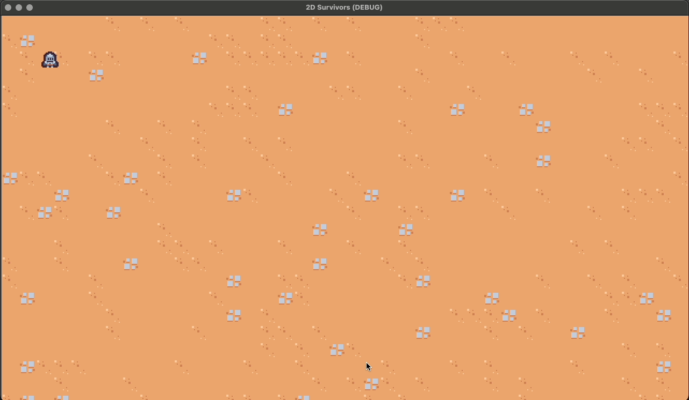

# 2D Survivors

Creating a 2D Arena Survival Roguelike Game in Godot 4 by following a Udemy course. This course covers the development of a small 2D arena survival roguelike game.

## Lessons

### Player Movement

### Creating a TileMap

### Game Camera

## References

- [GDScript Reference](https://docs.godotengine.org/en/stable/tutorials/scripting/gdscript/gdscript_basics.html)
- [Complete 2D Arena Survival Roguelike Game in Godot 4 - Udemy Course](https://www.udemy.com/course/create-a-complete-2d-arena-survival-roguelike-game-in-godot-4)
